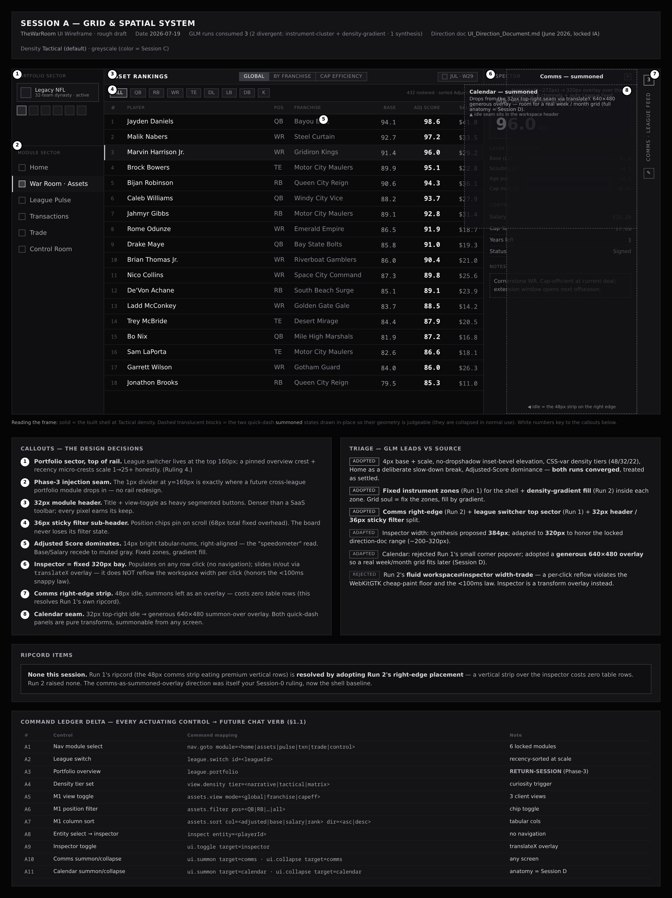
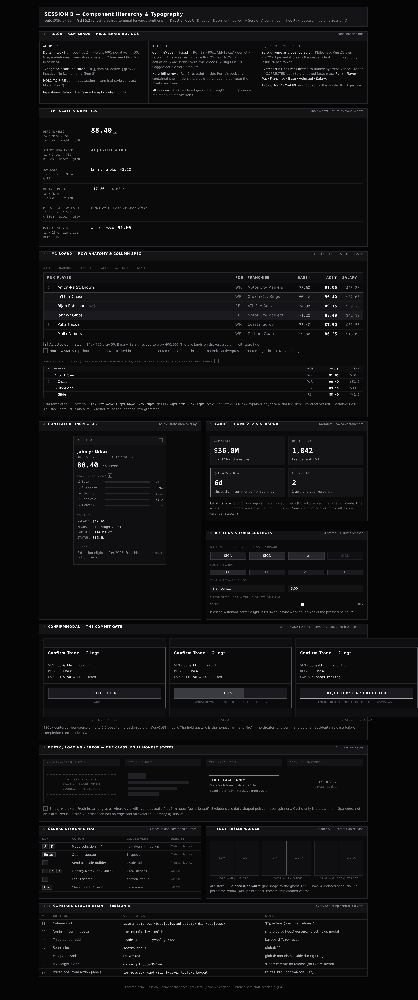
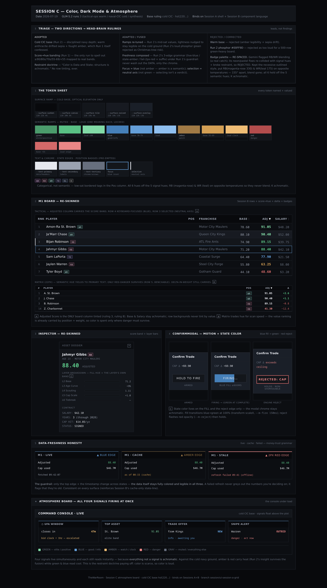
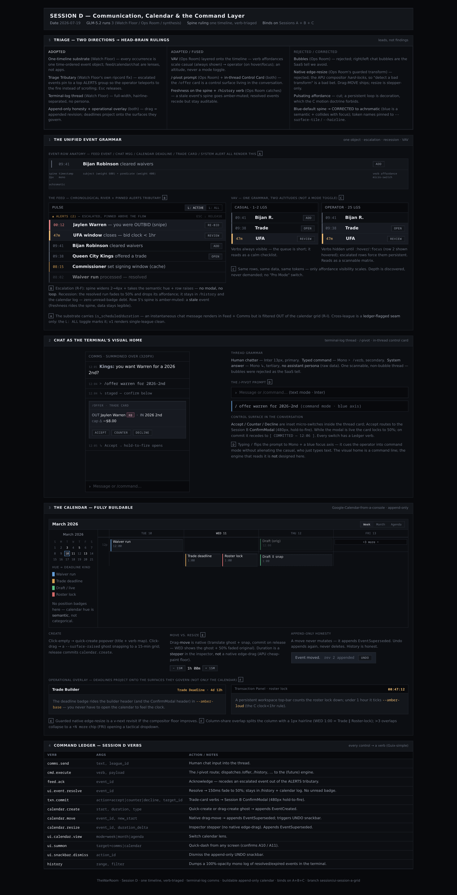

<div align="center">

# 🏈 TheWarRoom

### Local-First Data Aggregation & Custom Ranking Engine for Elite Dynasty Leagues

**A compiled Go intelligence center that ingests a live 32-team dynasty league, fuses it with 21 pro scouting sources, and prices every player, every contract, and every cap consequence — on your machine, at native speed, with the math done for you.**

<br/>

[](#-the-command-console--the-road-to-alpha)

[](https://go.dev)
[](#-4--the-war-room-architecture)
[](#-2--the-problem--the-solution)
[](#-3--feature-showcase)
[](#-3--feature-showcase)
[](#-3--feature-showcase)

[](https://wails.io)
[](https://react.dev)
[](https://tailwindcss.com)
[](https://sqlite.org)
[](https://home.myfantasyleague.com)

*32 teams. Six scoring layers. Ten position models. Twenty-one scouting sources. **One number per player.***

</div>

```
 ┌──────────────────────────────────────────────────────────────────────────────┐
 │  THEWARROOM // SYSTEM READOUT                                                │
 │                                                                              │
 │  ENGINE ......... ONLINE     6 layers · 10 position models · pure & fail-loud│
 │  PIPELINE ....... LIVE       1,217 players · 32 franchises · zero loss       │
 │  SCOUTING ....... COMPLETE   RAS · school · production · breakout · FILM     │
 │  LEDGER ......... EXACT      int64 cents · append-only · $0.00 drift, ever   │
 │  RULEBOOK ....... ARMED      §6–§14 phase-gated · atomic · quote-then-commit │
 │  CONSOLE ........ BUILDING   design A–E confirmed · instrument shell LIVE    │
 │  ENDGAME ........ CHARTED    replace the platform · seat the AI owners       │
 └──────────────────────────────────────────────────────────────────────────────┘
```

---

## ⚡ 1 · The Hook

> MyFantasyLeague gives you a roster and a box score.
> **TheWarRoom gives you a front office.**

Stock fantasy platforms and fragile spreadsheets fall apart the instant a league gets *serious* — 32 teams, per-year salary caps, multi-year contracts, dead-cap penalties, franchise tags, IDP scoring, and a decade of history that all has to reconcile to the penny. That's not a fantasy app's job anymore. That's a **data system**.

TheWarRoom is that system: a local-first, compiled Go engine that pulls your live league, runs every rostered player through a **six-layer valuation pipeline** built on *your* exact ruleset, and turns the result into a single **Adjusted Score** — then hands you a war room of tools that convert that score into decisions. Who to bid on. What a trade is really worth. What a contract costs you three years from now. And it executes those moves *atomically*, with the cap arithmetic computed and applied automatically.

No cloud. No latency. No data leaving your machine. **Just an edge.**

And the edge is not the endgame. MFL provides six things — hosting, scoring, lineups, waivers, the draft, and comms. **TheWarRoom is cutting them one at a time, each cut earned by running it in parity first.** The last thing to go is the platform itself.

---

## 🎯 2 · The Problem & The Solution

### The problem the stock tools can't touch

A hyper-complex dynasty league is a **hard data problem wearing a football jersey**:

- **Scale** — 32 franchises, 1,200+ rostered players, deep IDP + offensive scoring across ten distinct position archetypes.
- **Contracts** — multi-year deals, per-year cap hits, franchise tags, restructures, extensions, buyouts, and dead-cap penalties that ripple forward through *future* seasons.
- **Truth** — the cap has to be *exact*. "About right" is a corrupted league. Floating-point drift is not acceptable when real trades hinge on the number.
- **Disparate signal** — MFL box scores, PFF grades, RAS athleticism, NGS coverage metrics, Madden film, breakout ages — twenty-one sources that don't agree on IDs, formats, or units.

Spreadsheets buckle. SaaS platforms hardcode *their* scoring and never expose *yours*. Neither shows its work.

### The solution

**A localized, blazingly fast Go intelligence center** that gives one manager a professional-grade front-office advantage right from their own machine:

```
   DISPARATE, MESSY SIGNAL        ───►     ONE UNIFIED LOCAL STATE     ───►     ONE NUMBER, ONE DECISION
   MFL · PFF · RAS · NGS · film            normalized · type-locked            Adjusted Score → the call
```

The engine separates *"is this player good?"* from *"how long does he have?"* — grading talent and aging as two different jobs, the way a real scout does. An elite receiver in his prime and a declining veteran can post the same box score. **TheWarRoom prices them apart.**

---

## 🚀 3 · Feature Showcase

### 🛰️ Multi-Block Ingestion Engine — *live, end-to-end*
Automated, robust data pipelines that pull the **real MFL league** over a rate-limited, host-routed transport, guard every boundary (MFL silently collapses single-element arrays, returns HTTP 200 with error bodies, and omits commissioner-created players — each trap is caught and tested), and normalize wildly disparate inputs into a single **type-locked domain state**. `1,217 players · 32 franchises · zero loss · reconciled to the penny.`

### ⚙️ Custom Valuation Engine — *6 layers, 10 models, all calibrated*
A mathematically flexible framework that crunches *this league's* exact scoring matrix — nothing hardcoded, every value MFL-sourced or admin-tunable. Six pure-function layers run in order; **ten position models**, each individually calibrated, because a shutdown corner and a power back are not graded on the same curve.

```
   L1 Data Hygiene   → L2 Rulebook Scoring → L3 Age Decay
   L4 Scouting Layer → L5 Cap Efficiency   → L6 Tiebreaker
                          ▼
                 ⭐ Adjusted Score  (one number per player)

   QB · RB · WR · TE · DT · DE · LB · CB · S · K   →  10 / 10 LIVE
```

RAS athleticism is weighted *per position* (gold at receiver, neutral at quarterback). The **Layer-4 scouting engine is complete** — athleticism, school tier, college production share, breakout age, and **film**, wired end-to-end for offense *and* IDP: fetch → crosswalk-join → Profile → per-position curve. Identity mapping and birthdates are pulled **once** upstream and threaded into every signal, so no source pays for the same lookup twice.

Film was the one that couldn't be cloned — it's a calibration problem, not a plumbing job, and it was built that way. A Madden sub-attribute backbone per position, with a **bounded** charting overlay on top: a player's charted quality is percentile-ranked against his own position group, and the adjustment is hard-clamped to ±0.10 so a single noisy season can nudge a grade but never invent one. **No weight in this engine was ever guessed.** Every threshold was pinned against a live distribution sample first — the IDP breakout line came out of 25,088 real college defensive player-seasons — and the ones that couldn't be honestly grounded were left neutral rather than faked.

*The architecture composes: each new signal was a calibration, not a rebuild.*

### 📒 The Per-Year Salary Ledger — *the sole source of cap truth*
Every contract is a row of **per-year cells**. Every change is an append-only, dated, immutable audit entry — the database itself rejects an edit to history. The cap is *derived* from the cells (`CapUsed = Σ paid cells + Σ dead cap − Σ cap relief`, floored at 0), never stored as a competing number. **Money is `int64` cents on a flat $10k grid** — no floating-point drift, exact by construction.

### 🔧 Atomic Transaction Engine — *the mechanical work, automated*
A **single transaction coordinator** is the only thing in the entire system allowed to change who-owns-what; everything else can only read. Every mutation runs inside one spanning database transaction — a multi-leg trade lands *entirely* or rolls back *whole*.

| Live & executing | What it does automatically |
|---|---|
| ✅ **Trades** | Atomic multi-leg swaps — no half-executed trade can exist |
| ✅ **Waivers / cuts** | §8 dead cap (`35% × salary × years left`) computed & charged on the spot |
| ✅ **Franchise tag (§9)** | Top-5-by-position pricing, 120%-of-prior floor — UI sends a player id, never a dollar |
| ✅ **Restructure (§11)** | Owner cap moves bounded by the rulebook — a violation is *unrepresentable* |
| ✅ **Extension §10 · Buyout §12 · special situations §13–§14** | Full contract rulebook, phase-gated |
| ✅ **Free Agency §6 (v1)** | Live free-agent pool + record-a-signing, with §12 buyout lockout, min-salary floor & UFA promotion on rollover |
| ✅ **Commissioner UFA calendar (§6)** | A signing window the commissioner opens/closes on top of the phase gate — closed blocks every signing, and it persists until toggled |

**🖥️ The operator workspace** — a subject-centric front office drives it all: pick a franchise by its *real team name* → see its roster by *real player name* → click a player and the panel offers **only the moves that are legal this phase** (an offseason-only buyout simply isn't there mid-season). Priced moves — cut, tag, extend, restructure, buyout, sign — **quote before they commit**: the engine dry-runs the *real* handler and rolls it back, so you see "this will commit" or the authoritative rejection reason *before* anything is written. You never type a player id or a dollar figure — the UI sends the intent, the engine computes the money.

**🔁 The trade builder** — its own surface, because a trade is the only move that spans *multiple* franchises. Browse any team's roster, add players to a cart, set each one's destination, and stage a single **atomic multi-leg swap** — the same quote-before-commit gate confirms the whole trade lands together or rolls back whole.

**🎖️ Commissioner controls** — the league-calendar and off-common-path powers live on their own surface, segregated from the per-player workspace: advance the season phase, roll the season over (§14), open or close the free-agency signing window (§6), and — under a red, irreversible divider — retirement, death, and cap-relief appeals (§13). Every one runs through the same dry-run-then-confirm gate.

*The contract ops (cut · tag · extend · restructure · buyout · sign) are verified end-to-end through the live operator workspace on real hardware — not just unit-tested. The trade builder and commissioner surfaces are built and awaiting the same live-hardware gate.*

### ⚡ Go-Powered, Local-First Performance
Zero cloud latency. Absolute privacy. Near-instant processing from a clean, compiled backend. The rankings board **re-ranks the instant you turn a calibration knob** in the admin console — the live tuning loop already works. Native desktop app; your league never leaves your machine.

---

## 📈 Build Progress — *engine done · contract rulebook done · the operator front office is going in*

A disciplined, session-by-session build — every session sized to a single context window, every session closed only after green tests, a **blind AI code review**, and real-hardware verification. Forty-plus sessions in, the whole logic core is shipped and the operator UI that drives it is well underway. Here's the board:

```
   Foundation & Scaffold      [██████████]  100%   ✅  Go · Wails · React · SQLite WAL · compiler-enforced arch
   Multi-Block Data Pipeline  [██████████]  100%   ✅  live MFL ingest → normalize → type-locked state
   Logic Stores               [██████████]  100%   ✅  rulebook · state · params · immutable output
   Scoring Engine (6 layers)  [██████████]  100%   ✅  pure, fail-loud pipeline
   Position Models            [██████████]  100%   ✅  QB·RB·WR·TE·DT·DE·LB·CB·S·K  — 10 / 10 calibrated
   Scouting Engine (Layer 4)  [██████████]  100%   ✅  RAS · school · production · breakout · FILM
   Asset Rankings Board (M1)  [██████████]  100%   ✅  real 32-team board, live re-rank on tune
   Salary Ledger (cutover)    [██████████]  100%   ✅  per-year cells = sole cap truth, append-only
   Transaction Rulebook       [██████████]  100%   ✅  trades · §8–§14 contract ops · §6 free agency v1
   Operator Workspace (M4)    [████████░░]  ~80%   ▸   phase-legal quote→commit · contract ops · trade builder · commish
   War-Room Modules (M2–M8)   [██░░░░░░░░]  ~15%   ▸   power rankings · matchups · trade analyzer · shadow ledger
   Admin / Calibration UIs    [███░░░░░░░]  ~25%   ▸   engine tuning + governance surfaces
   Command Console (UI shell)  [███░░░░░░░]  ~25%   ▸   design A–E CONFIRMED · B-1 shell & tokens LIVE

   ────────────────────────────────────────────────────────────────────────────────────────────
   OVERALL   [████████████████████████░░░░]   logic core 100%   ·   operator UI in progress   ·   ~85%
```

📋 Full session-by-session ledger: **[`docs/build-handoffs/Build_Tracker.md`](docs/build-handoffs/Build_Tracker.md)** — *the engine and the entire contract rulebook are done; the operator UI that surfaces them is being built out slice by slice.*

---

## 🎛️ The Command Console — The Road to Alpha

> The engine is done. The rulebook is done. The moves execute atomically against a ledger that's exact to the penny.
> **Now it gets a cockpit worthy of it — and then it leaves the building.**

<div align="center">

[](docs/ui/Wireframe_Session_Plan.md)
[](docs/ui/Wireframe_Session_Plan.md)
[](docs/ui/Wireframe_Session_Plan.md)

</div>

The next front is the one you can *see*: transforming the operator workspace into a true **command console**. The bar is Anduril, not SaaS — dark, precise, data-dense without a pixel of waste. Confident hierarchy. Controls that look like they actuate real hardware, because here they *do*: every button is wired to an engine that moves real cap dollars atomically. The UI should communicate capability before you click anything.

### The design language — locked, and now shipping

Five design sessions. Each one fired as **divergent AI provocations**, triaged against locked architecture, judged on vision, confirmed. Together they are the finished visual doctrine the app is now being built against — a cold naval-CIC instrument console where **color is data, structure is silence, and nothing moves that isn't feedback.**

> **These are the confirmed design-session artifacts** (greyscale grid → typographic system → color/atmosphere → command layer) — the *spec*, hand-rendered. The live app is now wearing the shell below; the module internals are being re-skinned to match, session by session.

<table>
<tr>
<td width="50%"><br><sub><b>A · Grid & Spatial System.</b> The fixed four-column instrument shell — nav rail, workspace, 320px contextual inspector as a transform overlay, and the right-edge quick-dash strip. "The table is the instrument; everything else is bezel."</sub></td>
<td width="50%"><br><sub><b>B · Component Hierarchy & Typography.</b> Inter for text, JetBrains Mono for data. Delta-in-weight. Hold-to-fire commit gate. Four row states. The 7-column asset facet map. Zero icon chrome — the type *is* the interface.</sub></td>
</tr>
<tr>
<td width="50%"><br><sub><b>C · Color, Dark Mode & Atmosphere.</b> Cold-CIC navy. Score→hue banding on the value column only. The restraint doctrine — "color is Data and State; structure is achromatic." Four live signals firing at once and each still reads instantly.</sub></td>
<td width="50%"><br><sub><b>D · Command & Calendar Layer.</b> One time-ordered event substrate — feed, chat, deadlines, trade cards, alerts — in a single row grammar. Terminal-log comms. A fully buildable, append-only-honest league calendar.</sub></td>
</tr>
</table>

### How it's being designed — an AI design engine, on a leash

Wireframes don't come from a template here. A creative design engine (**GLM-5.2**) is fired with divergent provocations — *instrument cluster* vs *density gradient*, *tactical amber* vs *naval CIC* — the head brain (**Claude**) triages the directions against the locked architecture, renders the survivors as wireframes, and the commissioner judges **vision only**. The whole loop runs in ~80 seconds a pass: brief → two divergent directions + a synthesis → triaged draft on screen. The machine proposes fast; the human decides once. **All five sessions are confirmed** ("flying colors" / "amazing" / "perfect pass" / "everything is a pass"). The design phase is *done.*

### What the console is hiding under the hood

- **⚡ Snappy is law, not a wish.** Every control acknowledges in under 100ms. Optimistic UI, skeletons over spinners, motion only as feedback. A console that responds like a mechanism.
- **🪜 Three altitudes, one surface.** *Glance* — a casual reads their league's state in seconds from color alone. *Operate* — the working tier. *Interrogate* — full Matrix density, keyboard-driven, every engine intermediate on screen. Depth is **discovered, never demanded**: no "Pro Mode" switch will ever exist. Built to serve the 1-league casual and the 25-league portfolio shark from the same screen.
- **📅 A fully functional league calendar** — Google-Calendar fluidity (click-to-create, drag-to-move, live ghost + snap) on top of the house's append-only ledger: dragging a deadline doesn't *edit* history, it *appends* a superseding revision. The commissioner's schedule becomes an operational overlay — the signing-window deadline appears **on the SIGN button**, not just in a calendar tab.
- **⌨️ Every control is secretly a command.** A **Command Ledger** maps every button, slider, and shortcut to a verb in a future chat-terminal language — because one day this whole console will be drivable from a chat box the way a terminal drives Linux. The UI being built now is the beautiful projection of that command layer.

### The ladder to Alpha

```
   DESIGN ✅ A grid → B components → C atmosphere → D command layer → E mobile harvest   [ALL CONFIRMED]
   BUILD    ✅ B-1 shell & tokens ── the console is LIVE ── you're looking at its design above
            ▶  B-2 module migration → B-3 CALENDAR (full function)
            → B-4 home & inspector → B-5 alpha hardening
            ─────────────────────────────────────────────────────────────
   🚨 ALPHA GATE — versioned, stamped builds. A full season run in anger.
      One operator, one console, one league — proven before it's shared.
```

*Alpha is deliberately a seat for one.* The tool gets run hard against a real season by the person who knows exactly what it should say — because a front office that hasn't survived its own commissioner has no business in anyone else's hands. The doors open when the product has earned them, not when the roadmap says so.

**B-1 just landed:** the four-column instrument shell and the Session-C token system are *running* — cold-CIC navy, Inter/JetBrains-Mono, density tiers, the transform-overlay inspector, edge-resizable zones. The existing modules are re-homed into it now; B-2 re-skins their internals to the component language above.

Every build rung under the full gate stack — 11-layer coding standards, race-clean tests, blind AI review, live-hardware verification. The same discipline that shipped a penny-exact engine now ships the cockpit. Full battle plan: [`docs/ui/Wireframe_Session_Plan.md`](docs/ui/Wireframe_Session_Plan.md) · worked example: [`Session 0`](docs/ui/wireframes/session-0-test/Session-0-Example.md).

---

## 🏛️ 4 · The War Room Architecture

A multi-block system design where the boundaries aren't conventions — they're **compiler-enforced law**. A violation is a *build failure*, not a code-review note.

```
   ┌──────────────────────────────────────────────────────────────────────────┐
   │                          THE DESKTOP INTERFACE                            │
   │              Wails v2  ·  React + Tailwind + Zustand                      │
   │      Asset Rankings · Operator workspace · Trade builder · Commissioner      │
   └───────────────────────────────┬──────────────────────────────────────────┘
                                    │  IPC (typed, one-way: UI reads / requests)
   ┌───────────────────────────────▼──────────────────────────────────────────┐
   │                       THE TRANSACTION COORDINATOR                          │
   │        the ONLY writer to league state · one atomic tx per op             │
   │        default-deny phase gate · derived cap · append-only ledger         │
   └───────────────┬───────────────────────────────────────┬──────────────────┘
                   │                                         │
   ┌───────────────▼───────────────┐         ┌───────────────▼──────────────────┐
   │      THE CALCULATION ENGINE    │         │       THE STORAGE LAYER           │
   │   6-layer PURE pipeline        │         │   SQLite (WAL) · split R/W pools  │
   │   no db · no net · no clock    │◄────────│   rulebook · state · params ·     │
   │   inputs in → score out        │  params │   immutable output · ledger       │
   └───────────────▲────────────────┘         └───────────────▲──────────────────┘
                   │                                           │
   ┌───────────────┴───────────────────────────────────────────┴────────────────┐
   │                     THE MULTI-BLOCK INGESTION LAYER                          │
   │   MFL transport → ingestion → normalize → playerid resolve → domain types   │
   │        21 scouting sources · boundary-guarded · fail-loud · read-only       │
   └─────────────────────────────────────────────────────────────────────────────┘
```

**The laws that hold it together:**

- **Three-layer separation** — real-football data is read-only; the app owns its logic; users mutate state *only* through validated transactions. No layer bleeds into another.
- **One writer** — a single coordinator changes league state; a planted test *proves* the read-only handle can't be cast back into a writer.
- **A pure engine** — the scoring pipeline imports no database, no network, no clock. A custom linter fails the build if anything dirties it.
- **Immutable history** — every score is stamped with its scoring config; ledgers are append-only and SQLite triggers reject edits. Change the engine, and last season stays exactly as it was scored.
- **Forgery-proof IDs** — player IDs literally cannot be fabricated; the bypass doesn't compile.

📐 Full system map: **[`SYSTEM_MAP.md`](SYSTEM_MAP.md)** · Build sequence: **[`docs/build-handoffs/Build_Tracker.md`](docs/build-handoffs/Build_Tracker.md)**

---

## 🗺️ 5 · The Draft Board — Roadmap

The engine is the hard part, and the engine is **done** — and the front office that operates it is already going in (roster moves, contract ops, trades, and commissioner controls all run live against the real ledger). What's ahead is the payoff on top: each remaining capability a new *analytical view* onto a score and a ledger that already exist.

**On the clock**
- 🎛️ **The command console + Alpha** — the design-and-build ladder above, ending with stamped, versioned builds and a full season run in anger.
- 📊 **The war-room modules** — Power Rankings (live!), Matchup Predictions, Trade Analyzer, Free-Agency Intel, Rookie Draft board, Commissioner Dashboard.
- 🕳️ **The shadow ledger** — dry-run any transaction against a *forked* cap before you commit it.

**Later rounds — the three horizons**
- 🗣️ **Horizon 1 · The Capologist** — a chat interface on a small **local** model. *"What's my dead cap in 2028 if I cut him?"* answered from the actual ledger, **with receipts**. Numbers never come from the model; the ledger disposes; you decide.
- 💼 **Horizon 2 · The Portfolio Desk** — one engine valuing the same player under *five* leagues' rules simultaneously. Asset management for dynasty football.
- 🎖️ **Horizon 3 · The January War Room** — **fork your franchise** and branch offseason futures like a developer branches code, each run through the *real* transaction engine — then your winning plan becomes the season's execution script.

---

### 🩸 The Cutover — retiring the platform, one function at a time

MFL provides six things. **TheWarRoom takes them back in order, and no cut ships until it has run in parity first.**

```
   ✅ 1 · CAP & CONTRACT BOOKKEEPING ── cut. The per-year ledger is the sole truth;
                                        MFL's salary fields are a mirror we audit.
   ▶  2 · SCORING ─────────────────── next. Stored rules × ingested stats.
      3 · WAIVERS & AUCTION ───────── the first operational cut. Needs the calendar.
      4 · ROOKIE DRAFT ROOM ───────── same machinery, one round later.
      5 · LINEUPS ────────────────── needs multi-user. MFL becomes display-only.
      6 · HOSTING & COMMS ────────── last. The lights go out on the old building.
```

**The trust-earning feature is the parity report, run as a product:** a full season of automated weekly scoring parity plus one complete offseason transaction window, kept in dual record with a discrepancy ledger. **Trust is earned the day the report catches the platform's error, not ours** — the app audits MFL, not the other way around. No operational cut before one clean parity season. That's the whole discipline in a sentence.

---

### 🤖 Horizon 4 · The AI Owners — the seat that never goes empty

Here is the problem no fantasy platform has ever solved, and it isn't technical. **Finding thirty-two people who will run a franchise with real effort, for years, is genuinely hard.** Owners burn out. Life happens. And when a GM walks, he doesn't leave a clean slate — he leaves a franchise shaped by every decision he made, and someone has to inherit it.

TheWarRoom is quietly building the answer, and it needs **zero new instrumentation** to do it. The append-only ledger is *already* a behavioral record. Every bid in a war that went nine rounds. Every snipe. Every restructure that bought a window. Every cut where a GM ate the dead cap to get free. It's all in there, dated, immutable, and attributable — **because the same append-only design that makes the cap exact makes behavior legible.**

From that record the engine derives a **GM profile** — not a rating, a *fingerprint*:

| Trait | Read from |
|:--|:--|
| **Risk appetite** | dead cap absorbed, voluntarily |
| **Time horizon** | roster age × remaining contract years |
| **Positional ideology** | where the cap actually goes, not what he says |
| **Operational fingerprint** | which moves he reaches for, and how often |
| **Timing behavior** | how early, how late, how patient |

Layer on a decade-plus of archived league history — real bidding wars, real snipes, real RFA matches between real people who were *trying to win* — and the fingerprint stops being a summary and becomes a **playable style.**

**An empty franchise gets an owner who plays like the league plays.** Not a bot that bids randomly and rots a roster. A GM with a philosophy: one that hoards picks, one that goes all-in on a window, one that always overpays at receiver — because that's what the record says GMs in *this* league actually do. Every move still runs through the same coordinator, the same phase gate, the same penny-exact ledger as a human. **No AI owner gets a rule a human doesn't get.**

> A 32-team dynasty league shouldn't die because six people got busy.
> **The seat stays filled. The league keeps playing.**

🔭 The full vision, on the record: **[`docs/roadmap/Vision_2026.md`](docs/roadmap/Vision_2026.md)** · the human behavior corpus: **[`docs/league-history/League_History_v1.md`](docs/league-history/League_History_v1.md)**

---

## 🤝 How It Gets Built — The Council

One human holds the vision and the veto. A council of AIs does the rest, each in the seat it's best in. No model gets rubber-stamped and no model gets to guess — every finding is a *lead*, triaged against the source. The machine proposes; the human and the rulebook decide.

<div align="center">

[](https://anthropic.com)
[](https://z.ai)
[](https://gemini.google.com)
[](https://deepseek.com)
[](#)

</div>

| Seat | Model | The job |
|:--:|:--|:--|
| 🛠️ | **Claude** *(Anthropic)* | The builder and head brain — writes the code, drives the reviews, keeps the map. |
| 🔍 | **GLM 5.2** *(Z.ai)* | The standing **blind code reviewer** — reads every build cold and hunts the bug the tests can't see. |
| 🎯 | **Gemini** *(Google)* | The second opinion — pulled in when a problem needs a fresh pair of eyes. |
| 🧩 | **DeepSeek** | The reasoner — brought to the table for the hardest, once-only architectural calls. |
| 🦅 | **Ornith** *(local — the heir)* | Runs on hardware **in the room**. Today it takes the work that stays home; **it is being trained for the job it will one day hold outright — the daily maintainer of this codebase once TheWarRoom goes enterprise.** Every review it shadows, every lesson it logs, is an apprenticeship. The plan is a self-hosted system of record maintained by a model that never leaves the building. |

> **Ornith is not the junior seat — it's the succession plan.** GLM, Gemini, and DeepSeek sharpen the code today; Ornith is learning to *own* it tomorrow. When this goes enterprise, the maintainer is already home.

---

## 📜 License & Ownership

**TheWarRoom is source-available, not open-source — free to run and tinker with, never to sell.**

- 🆓 **Free forever for non-commercial use** — released under the [**PolyForm Noncommercial License 1.0.0**](LICENSE). Run it, fork it, self-host it, study it, share it. Homelabbers and hobbyists: this is yours to play with.
- 🏛️ **Owned, in full, by SecureProspective LLC** (Texas) — all rights reserved. Copyright never leaves the owner.
- 🙏 **Tech Freedom Ministries holds a perpetual, irrevocable, free-use grant** — including commercial use — that **survives any change of ownership.** TFM is the inspiration for this project; its rights are permanent and cannot be altered by any future buyer. See [`docs/licensing/TFM-Grant.md`](docs/licensing/TFM-Grant.md).
- 💼 **Commercial use and sale are reserved to SecureProspective.** Want to use TheWarRoom commercially? [Contact SecureProspective](https://secureprospective.com) for terms.
- 🤝 **Contributions welcome** — by contributing you agree to the [Contributor License Agreement](CLA.md), which keeps ownership consolidated with SecureProspective while you keep the copyright to your own work. Start with [`CONTRIBUTING.md`](CONTRIBUTING.md).

> 📖 The whole licensing picture in plain English: [`docs/licensing/README-license-summary.md`](docs/licensing/README-license-summary.md).

---

<div align="center">

*Built by Christopher Campbell with Claude (Anthropic) — reviewed, challenged, and sharpened by a council of GLM, Gemini, DeepSeek, and Ornith.*

**Today, MFL gives you the league and TheWarRoom helps you win it.**

**Tomorrow, there is no MFL — and the seat never goes empty.**

</div>
