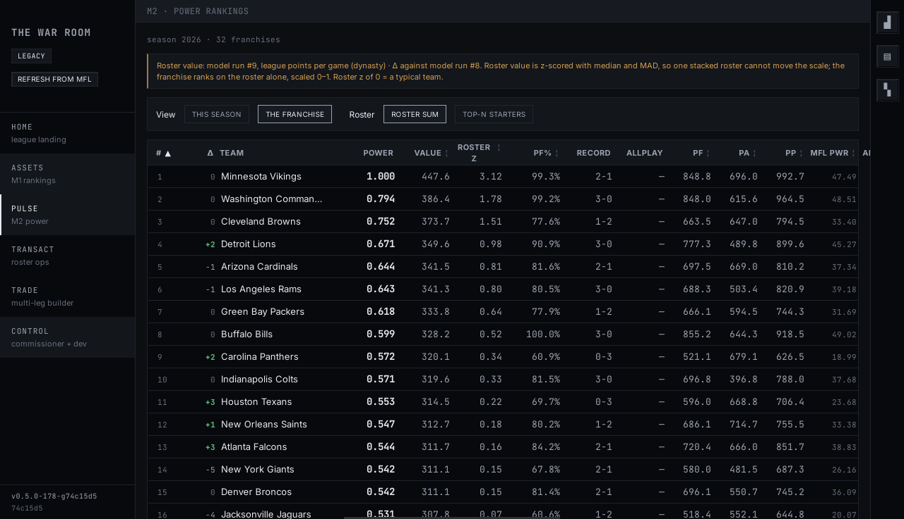
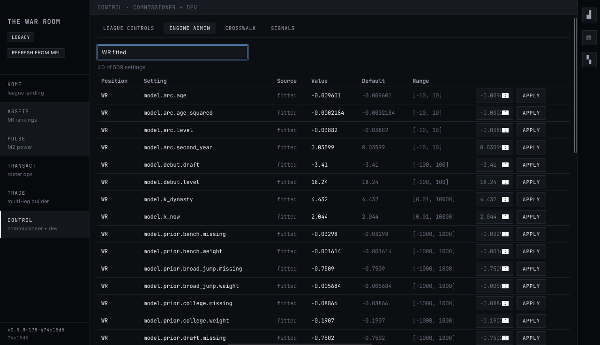
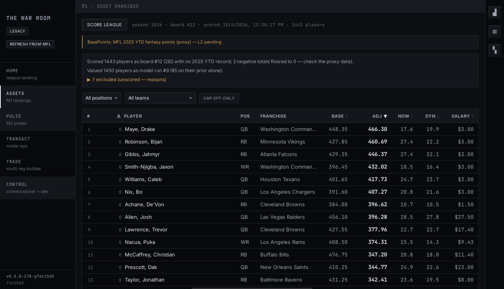
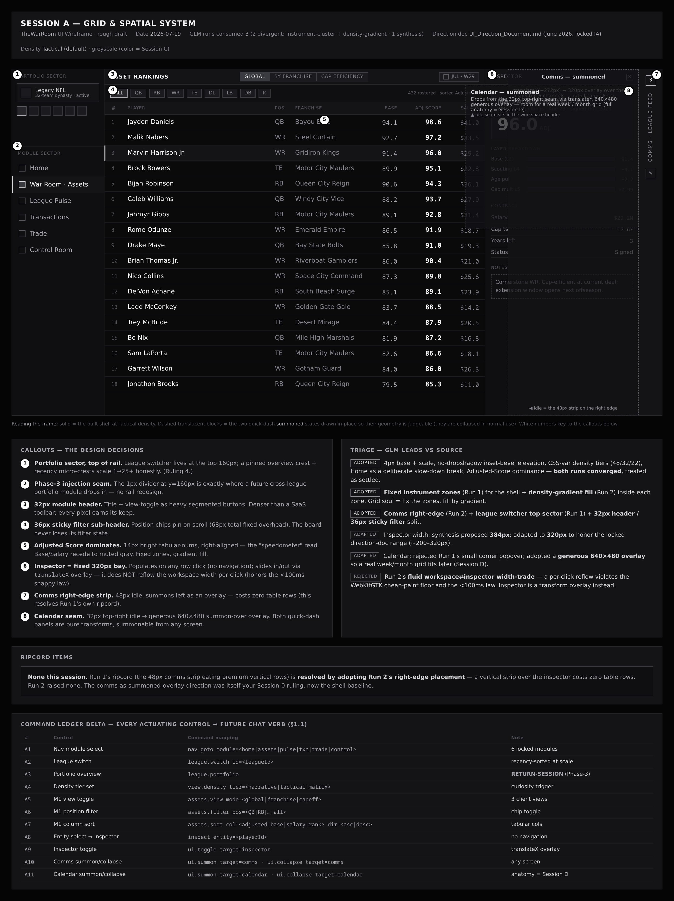
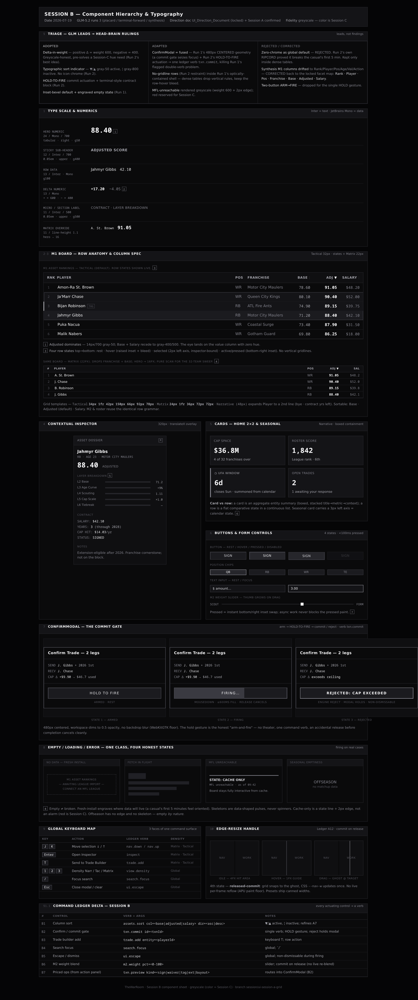
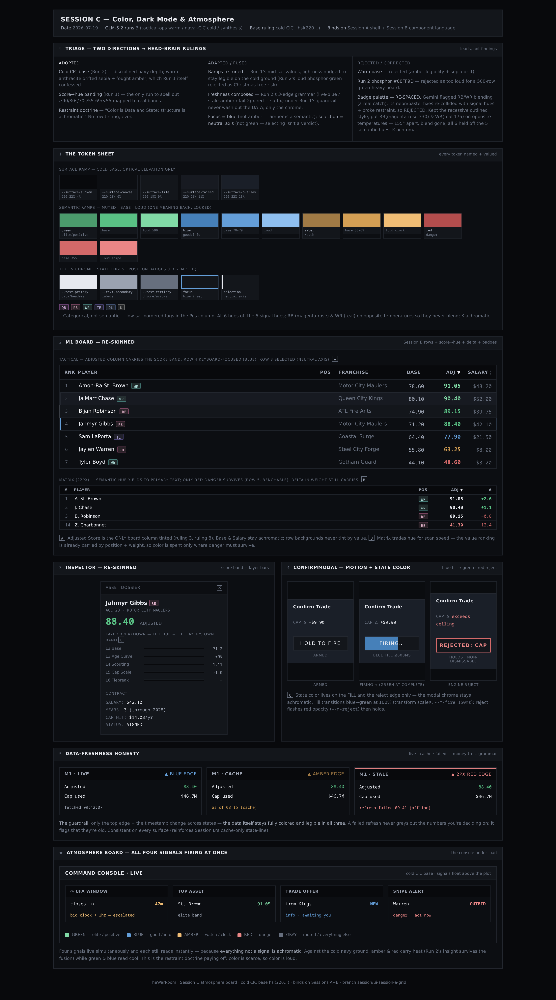
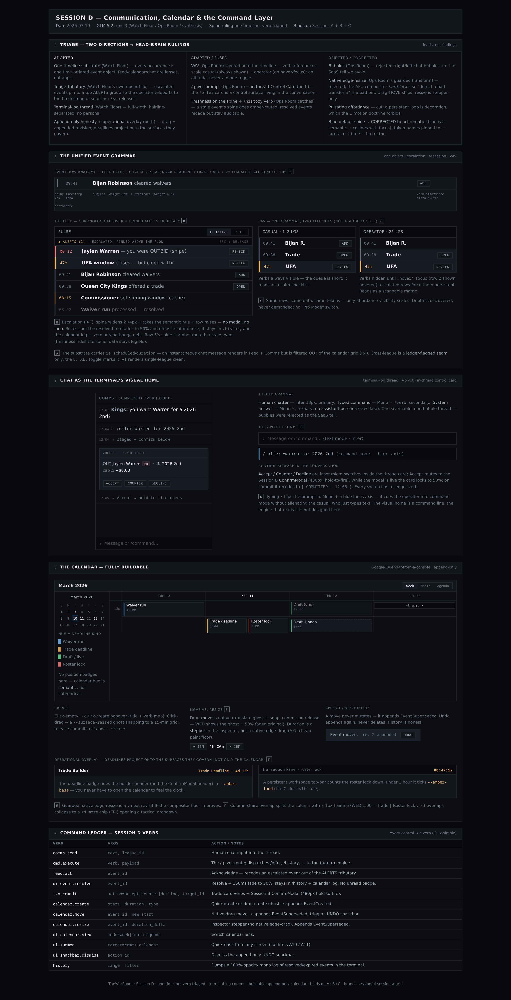

<div align="center">

# 🏈 TheWarRoom

### Local-First Data Aggregation & Custom Ranking Engine for Elite Dynasty Leagues

**A compiled Go intelligence center that ingests a live 32-team dynasty league, fuses it with five seasons of NFL history, fits two numbers to every player on the league's own scoring, and prices every contract and every cap consequence — on your machine, at native speed, with the math done for you.**

<br/>

[](#-the-onion--build-progress)

[](https://go.dev)
[](#-3--two-numbers-per-player)
[](#-3--two-numbers-per-player)
[](#-2--the-problem--the-solution)
[](#-4--feature-showcase)
[](#-4--feature-showcase)
[](#-4--feature-showcase)

[](https://wails.io)
[](https://react.dev)
[](https://tailwindcss.com)
[](https://sqlite.org)
[](https://home.myfantasyleague.com)

*32 teams. Ten position models. Five seasons of history. **Two numbers per player. One front office.***

</div>

```
 ┌──────────────────────────────────────────────────────────────────────────────┐
 │  THEWARROOM // SYSTEM READOUT                                                │
 │                                                                              │
 │  ENGINE ......... ONLINE     6 layers · 10 position models · pure & fail-loud│
 │  MODEL .......... FITTED     400 values · 2021–2025 · every piece earned it  │
 │  MEASURABLES .... LIVE       Now + Dynasty · 1,450 players · rookies too     │
 │  HISTORY ........ STORED     ~1M values · 105 measures · append-only         │
 │  PIPELINE ....... LIVE       MFL · nflverse · DynastyProcess · CFBD · free   │
 │  POWER RANKS .... LIVE       this season · the franchise · Δ every run       │
 │  LEDGER ......... EXACT      int64 cents · append-only · $0.00 drift, ever   │
 │  ENDGAME ........ CHARTED    replace the platform · seat the AI owners       │
 └──────────────────────────────────────────────────────────────────────────────┘
```



<sub>📸 **The live app — M2 Power Rankings, "The franchise" view:** every roster's summed dynasty value, ranked, with each team's move since the previous model run. Real league, real numbers.</sub>

---

## ⚡ 1 · The Hook

> MyFantasyLeague gives you a roster and a box score.
> **TheWarRoom gives you a front office.**

Stock fantasy platforms and fragile spreadsheets fall apart the instant a league gets *serious* — 32 teams, per-year salary caps, multi-year contracts, dead-cap penalties, franchise tags, IDP scoring, and years of history that all have to reconcile to the penny. That's not a fantasy app's job anymore. That's a **data system**.

TheWarRoom is that system: a local-first, compiled Go engine that pulls your live league, reads five seasons of NFL history into one store, and gives every rostered player **two numbers fitted to *your* league's scoring** — what he's worth this season, and what he's worth to the franchise. Then it hands you a war room of tools that turn those numbers into decisions. Who to bid on. Which roster is really the best in the league. What a contract costs you three years from now.

No cloud. No latency. No data leaving your machine. **Just an edge.**

### 🏟️ Why 32 teams

The 32-team league is where fantasy football is going. Every NFL franchise has a GM. Rosters run deep, defenses score, the cap bites, and the waiver wire is thin — it's the closest thing to running a real front office, and it's where the serious players are heading. The platforms weren't built for it, and spreadsheets can't keep up with it. **TheWarRoom intends to lead that charge.**

And the edge isn't the endgame. MFL provides six things — hosting, scoring, lineups, waivers, the draft, and comms. **TheWarRoom will take them back one at a time, each cut earned by running in parity first.** The last thing to go is the platform itself.

---

## 🎯 2 · The Problem & The Solution

### The problem the stock tools can't touch

A hyper-complex dynasty league is a **hard data problem wearing a football jersey**:

- **Scale** — 32 franchises, 1,450 rostered players, deep IDP + offensive scoring across ten distinct position archetypes.
- **Contracts** — multi-year deals, per-year cap hits, franchise tags, restructures, extensions, buyouts, and dead-cap penalties that ripple forward through *future* seasons.
- **Truth** — the cap has to be *exact*. "About right" is a corrupted league. Floating-point drift is not acceptable when real trades hinge on the number.
- **Disparate signal** — MFL box scores, weekly snaps, combine testing, college production, charted coverage, and nineteen different player-id systems — sources that don't agree on IDs, formats, or units.

Spreadsheets buckle. SaaS platforms hardcode *their* scoring and never expose *yours*. Neither shows its work.

### The solution

**A localized, blazing-fast Go intelligence center** that gives one manager a professional-grade front-office advantage right from their own machine:

```
   DISPARATE, MESSY SIGNAL     ───►   ONE MEASURE HISTORY              ───►   TWO NUMBERS, ONE CALL
   MFL · nflverse · CFBD · ids        player · season · week · measure        Now + Dynasty
```

The engine separates *"is this player good?"* from *"how long does he have?"* — grading talent and aging as two different jobs, the way a real scout does. An elite receiver in his prime and a declining veteran can post the same box score. **TheWarRoom prices them apart.**

---

## 🧠 3 · Two Numbers Per Player

Every rostered player, rookies included, gets two values, both in **this league's fantasy points per game**:

| | The question it answers |
|:--:|:--|
| 🔥 **Now** | What does he score per game he plays, *this season*? |
| 🏛️ **Dyn** | What is he worth over this season and the next two — each later season counting 0.75 of the one before — times his chance of actually being on the field? |

Both come from one rule, the **credibility blend**: trust a player's production in proportion to how much of it there is.

```
                    ┌──────────────────────────────────────────────┐
   production ────► │  value = Z · production + (1 − Z) · prior    │ ────► 🔥 Now
   (league pts/g)   │                                              │
                    │        Z = games / (games + k)               │ ────► 🏛️ Dyn
   prior ─────────► │  k fitted per position · age via career arcs │   (+ survival,
   (pre-NFL facts)  └──────────────────────────────────────────────┘    3 seasons)
```

- 📊 **Production** — his league points per game as a percentile among the regulars at his position, recent seasons weighted more.
- 🎓 **The prior** — what his pre-NFL facts predict: draft slot, combine, college production, age at entry. It never sees a fantasy point, so it's a true second opinion, not production counted twice.
- ⚖️ **k** — how many games before production outweighs the prior, fitted per position. A kicker's season says far less about his next than a quarterback's does, and the math knows it.
- ⏳ **Age enters once**, through a fitted career arc per position. A 31-year-old running back and a 31-year-old quarterback with identical numbers are valued apart.
- 🐣 **Rookies are never zero.** Until he plays, a rookie is valued on his prior and on the chance a player drafted where he was takes the field.

### 🔬 Fitted, then checked on a season it never saw

The model's **400 values** are fitted on the league's own scoring history, 2021–2025. Every optional piece — the career arc, the recency weights, the survival model, the rookie debut chance — has to **beat its simpler alternative at predicting 2025 with 2025 held out**, or it doesn't ship. Three fits, byte-identical output.

```
   THE HOLDOUT — 2025, predicted blind from data through 2024, against the app's old board
   ─────────────────────────────────────────────────────────────────────────────────────
   TALENT    model wins 9 of 10 positions     RB .76 vs .53 · TE .80 vs .56   (rank corr.)
   ROOKIES   model ranks them .41 – .86       old board: every rookie scored zero
   KICKERS   nobody wins                      a kicker's season barely predicts his next
```

**No hiding the misses.** The kicker result sits in the fit report ([`docs/fit/Fit_Report.md`](docs/fit/Fit_Report.md)) right next to the wins.

Every setting the engine reads — **509 of them**, fitted values and scouting weights included — sits in the **Engine Admin** console, marked fitted or hand-set, and editable. Change one, score the league, and a new run lands beside the old one. **Every earlier run stays readable, forever.**



<sub>📸 **Engine Admin, filtered to "WR fitted":** the receiver's career arc, debut chance, k values and prior weights — every one a dial.</sub>

---

## 🚀 4 · Feature Showcase

### 🛰️ Multi-Block Ingestion Engine — *live, end-to-end*
Automated, robust data pipelines that pull the **real MFL league** over a rate-limited, host-routed transport, guard every boundary (MFL silently collapses single-element arrays, returns HTTP 200 with error bodies, and omits commissioner-created players — each trap is caught and tested), and normalize wildly disparate inputs into a single **type-locked domain state**. `1,450 rostered players · 32 franchises · zero loss · reconciled to the penny.`

### 🗄️ The Data — one history, four free pipelines

Every number lands in **one table**: `player · season · week · measure`. About a **million values from 2021 on**, under **105 measures** named for what they *mean*, never for the source that sent them. The model reads measures, so swapping a source changes zero model code.

| Pipeline | What it brings |
|:--|:--|
| 🟠 [**MyFantasyLeague**](https://www.myfantasyleague.com) | The league itself: rosters, contracts, standings, and its scoring of every player, every season since 2021 |
| 🏈 [**nflverse**](https://github.com/nflverse/nflverse-data) | Weekly stats, snaps, injuries, the draft, the combine, and advanced defensive charting |
| 🔗 [**DynastyProcess**](https://github.com/dynastyprocess/data) | The player-id crosswalk that stitches every source together — **124,906 links** |
| 🎓 [**CollegeFootballData**](https://collegefootballdata.com) | College production and school tier |

All four are free. Behind them sits a vetted library of **25 scouting and intelligence sources** ([`docs/sources/Approved_Sources.md`](docs/sources/Approved_Sources.md)) — where the next pipelines come from. The **Signals** console shows every feed's coverage by season and position, plus its freshness. And **a lost source never stops the board** — it runs on what still flows and tells you it's running reduced.

### ⚙️ Custom Valuation Engine — *6 layers, 10 models, and the fitted model beside it*
A mathematically flexible framework that crunches *this league's* exact scoring — nothing hardcoded, every value MFL-sourced or admin-tunable. Six pure-function layers run in order; **ten position models**, each individually tuned, because a shutdown corner and a power back are not graded on the same curve. The fitted model runs alongside, so every player carries **Adj**, **Now**, and **Dyn** on one board.

```
   L1 Data Hygiene   → L2 League Points    → L3 Age Decay
   L4 Scouting Layer → L5 Cap Efficiency   → L6 Tiebreaker
                          ▼
                 ⭐ Adjusted Score           +   🔥 Now · 🏛️ Dyn  (the fitted model)

   QB · RB · WR · TE · DT · DE · LB · CB · S · K   →  10 / 10 LIVE
```

**The scouting layer** reads athleticism, school tier, college production share, breakout age, and — at corner and safety — charted coverage. Its caps and weights are all Admin settings now. RAS athleticism is weighted *per position* (gold at receiver, neutral at quarterback). Every threshold was pinned against a live distribution sample first — the IDP breakout line came out of **25,088 real college defensive player-seasons** — and the ones that couldn't be honestly grounded were left neutral rather than faked.

**And when a signal doesn't earn its place, it goes.** Madden ratings used to feed the film score. Measured against the board, Madden's film score sat above the midpoint for *every* rostered player — a flat lift of up to 5% that separated no one. So it was cut, with the diff reported. The refactor that made the rubrics editable proved itself bit-identical first: **20,000 generated inputs per position, same hash before and after.**



<sub>📸 **M1 Asset Rankings:** the adjusted score, Now and Dyn on every rostered player, with each player's move since the last run.</sub>

### 📊 Power Rankings (M2) — *two views of the league*
- **🔥 This season** — each roster's summed **Now**, z-blended with the season's results at a weight you slide. It reads MFL's all-play record when the league reports one, and points for when it doesn't.
- **🏛️ The franchise** — each roster's summed **Dyn**, and nothing else. Who's built to win for years, not just this month.

Every board shows each team's **Δ** since the previous model run. Turn a dial in Admin and watch the league reorder.

### 📒 The Per-Year Salary Ledger — *exact to the cent*
Every contract is a row of **per-year cells**. Every change is an append-only, dated, immutable audit entry — the database itself rejects an edit to history. The cap is *derived* from the cells (`CapUsed = Σ paid cells + Σ dead cap − Σ cap relief`, floored at 0), never stored as a competing number. **Money is `int64` cents on a flat $10k grid** — no floating-point drift, exact by construction.

### 🔧 Atomic Transaction Engine — *the mechanical work, automated*
A **single transaction coordinator** is the only thing in the entire system allowed to change who-owns-what; everything else can only read. Every mutation runs inside one spanning database transaction — a multi-leg trade lands *entirely* or rolls back *whole*.

> 🧭 **Today, MFL is the record.** A refresh brings the league home from MFL, and moves made in TheWarRoom run on a separate **what-if league**: plan the trade, price the cut, see the cap three years out — then make the move on MFL. The cutover below is how that flips.

| Built & executing | What it does automatically |
|---|---|
| ✅ **Trades** | Atomic multi-leg swaps — no half-executed trade can exist |
| ✅ **Waivers / cuts** | §8 dead cap (`35% × salary × years left`) computed & charged on the spot |
| ✅ **Franchise tag (§9)** | Top-5-by-position pricing, 120%-of-prior floor — UI sends a player id, never a dollar |
| ✅ **Restructure (§11)** | Owner cap moves bounded by the rulebook — a violation is *unrepresentable* |
| ✅ **Extension §10 · Buyout §12 · special situations §13–§14** | Full contract rulebook, phase-gated |
| ✅ **Free Agency §6 (v1)** | Free-agent pool + record-a-signing, with §12 buyout lockout, min-salary floor & UFA promotion on rollover |
| ✅ **Commissioner UFA calendar (§6)** | A signing window the commissioner opens/closes on top of the phase gate |

**🖥️ The operator workspace** — a subject-centric front office drives it all: pick a franchise by its *real team name* → see its roster by *real player name* → click a player and the panel offers **only the moves that are legal this phase** (an offseason-only buyout simply isn't there mid-season). Priced moves — cut, tag, extend, restructure, buyout, sign — **quote before they commit**: the engine dry-runs the *real* handler and rolls it back, so you see "this will commit" or the authoritative rejection reason *before* anything is written. You never type a player id or a dollar figure — the UI sends the intent, the engine computes the money.

**🔁 The trade builder** — its own surface, because a trade is the only move that spans *multiple* franchises. Browse any team's roster, add players to a cart, set each one's destination, and stage a single **atomic multi-leg swap** — the same quote-before-commit gate confirms the whole trade lands together or rolls back whole.

**🎖️ Commissioner controls** — the league-calendar and off-common-path powers live on their own surface: advance the season phase, roll the season over (§14), open or close the free-agency signing window (§6), and — under a red, irreversible divider — retirement, death, and cap-relief appeals (§13). Every one runs through the same dry-run-then-confirm gate.

### ⚡ Go-Powered, Local-First Performance
Zero cloud latency. Absolute privacy. Near-instant processing from a clean, compiled backend. Turn a dial in the admin console, press **Score League**, and a fresh board and model run land in under a minute — the old ones still on the record for comparison. Native desktop app; your league never leaves your machine.

---

## 🧅 The Onion — Build Progress

TheWarRoom is built like an onion: **one layer at a time, each one solid before the next goes on.** Layer 1 — the core — is what everything else stands on. In October 2026 it was rebuilt to that standard, stage by stage, and every stage closed on a **live gate**: the production build, run against a snapshot of the real database on a separate machine, with screenshots as evidence.

```
   🧅 LAYER 1 · THE CORE                                            ✅ SOLID
   ──────────────────────────────────────────────────────────────────────────
   0  One timeline           [██████████] ✅  code · data · docs agree
   1  The measure store      [██████████] ✅  append-only, every run readable
   2  League truth from MFL  [██████████] ✅  one mirror, what-if isolated
   3  The crosswalk          [██████████] ✅  99.6% of rostered players matched
   4  Signals into the store [██████████] ✅  ~1M values, 2021 → today
   5  Rubrics as data        [██████████] ✅  bit-identical, Madden out
   6  The fit                [██████████] ✅  400 values, holdout-checked
   7  The two measurables    [██████████] ✅  Now + Dyn on every player
   8  Power rankings on them [██████████] ✅  two views, Δ every run

   🧅 LAYER 2 · THE WAR-ROOM MODULES    ▸ next  matchups · trades · FA intel · draft
   🧅 LAYER 3 · COMMAND CONSOLE + ALPHA ▸      the cockpit · a full season in anger
   🧅 LAYER 4 · THE CUTOVER             ▸      scoring · waivers · draft · lineups
   🧅 LAYER 5 · THE HORIZONS            ▸      Capologist · Portfolio · AI owners
```

📋 Every design decision and gate record: **[`docs/build-handoffs/Core_Build_Plan_2026-10.md`](docs/build-handoffs/Core_Build_Plan_2026-10.md)** · the build before it: **[`docs/build-handoffs/Build_Tracker.md`](docs/build-handoffs/Build_Tracker.md)**

**Known limits, on the record** (that's how you know the rest is real): in-season, Now leans a little too heavily on the current season's games; a rookie who hasn't played yet keeps his draft-day chance of taking the field; and kickers, as above.

---

## 🎛️ The Command Console — The Road to Alpha

> The engine is done. The core is solid. The moves execute atomically against a ledger that's exact to the penny.
> **Now it gets a cockpit worthy of it — and then it leaves the building.**

<div align="center">

[](docs/ui/Wireframe_Session_Plan.md)
[](docs/ui/Wireframe_Session_Plan.md)
[](docs/ui/Wireframe_Session_Plan.md)

</div>

The next front is the one you can *see*: turning the operator workspace into a true **command console**. The bar is Anduril, not SaaS — dark, precise, data-dense without a pixel of waste. Confident hierarchy. Controls that look like they actuate real hardware, because here they *do*: every button is wired to an engine that moves real cap dollars atomically. The UI should communicate capability before you click anything.

### The design language — locked, and shipping

Five design sessions, each one fired as **divergent AI provocations**, triaged against locked architecture, judged on vision, confirmed. Together they are the visual doctrine the app is built against — a cold naval-CIC instrument console where **color is data, structure is silence, and nothing moves that isn't feedback.** The screenshots above are that shell, live.

> **These are the confirmed design-session artifacts** (greyscale grid → typographic system → color/atmosphere → command layer) — the *spec*, hand-rendered.

<table>
<tr>
<td width="50%"><br><sub><b>A · Grid & Spatial System.</b> The fixed four-column instrument shell — nav rail, workspace, 320px contextual inspector as a transform overlay, and the right-edge quick-dash strip. "The table is the instrument; everything else is bezel."</sub></td>
<td width="50%"><br><sub><b>B · Component Hierarchy & Typography.</b> Inter for text, JetBrains Mono for data. Delta-in-weight. Hold-to-fire commit gate. Four row states. The 7-column asset facet map. Zero icon chrome — the type *is* the interface.</sub></td>
</tr>
<tr>
<td width="50%"><br><sub><b>C · Color, Dark Mode & Atmosphere.</b> Cold-CIC navy. Score→hue banding on the value column only. The restraint doctrine — "color is Data and State; structure is achromatic." Four live signals firing at once and each still reads instantly.</sub></td>
<td width="50%"><br><sub><b>D · Command & Calendar Layer.</b> One time-ordered event substrate — feed, chat, deadlines, trade cards, alerts — in a single row grammar. Terminal-log comms. A fully buildable, append-only-honest league calendar.</sub></td>
</tr>
</table>

### What the console is hiding under the hood

- **⚡ Snappy is law, not a wish.** Every control acknowledges in under 100ms. Optimistic UI, skeletons over spinners, motion only as feedback. A console that responds like a mechanism.
- **🪜 Three altitudes, one surface.** *Glance* — a casual reads their league's state in seconds from color alone. *Operate* — the working tier. *Interrogate* — full Matrix density, keyboard-driven, every engine intermediate on screen. Depth is **discovered, never demanded**: no "Pro Mode" switch will ever exist. Built to serve the 1-league casual and the 25-league portfolio shark from the same screen.
- **📅 A fully functional league calendar** — Google-Calendar fluidity (click-to-create, drag-to-move, live ghost + snap) on top of the house's append-only ledger: dragging a deadline doesn't *edit* history, it *appends* a superseding revision. The signing-window deadline appears **on the SIGN button**, not just in a calendar tab.
- **⌨️ Every control is secretly a command.** A **Command Ledger** maps every button, slider, and shortcut to a verb in a future chat-terminal language — because one day this whole console will be drivable from a chat box the way a terminal drives Linux.

### The ladder to Alpha

```
   DESIGN ✅ A grid → B components → C atmosphere → D command layer → E mobile  [ALL CONFIRMED]
   SHELL  ✅ B-1 shell & tokens ── the console is LIVE ── you're looking at it above
   CORE   ✅ Layer 1 rebuilt: fitted model · Now + Dyn · power rankings on them
          ▶  B-2 module migration → B-3 CALENDAR (full function)
          → B-4 home & inspector → B-5 alpha hardening
          ─────────────────────────────────────────────────────────────
   🚨 ALPHA GATE — versioned, stamped builds. A full season run in anger.
      One operator, one console, one league — proven before it's shared.
```

*Alpha is deliberately a seat for one.* The tool gets run hard against a real season by the person who knows exactly what it should say — because a front office that hasn't survived its own commissioner has no business in anyone else's hands. The doors open when the product has earned them, not when the roadmap says so.

Full battle plan: [`docs/ui/Wireframe_Session_Plan.md`](docs/ui/Wireframe_Session_Plan.md) · worked example: [`Session 0`](docs/ui/wireframes/session-0-test/Session-0-Example.md).

---

## 🏛️ 5 · The War Room Architecture

A multi-block system design where the boundaries aren't conventions — they're **compiler-enforced law**. A violation is a *build failure*, not a code-review note.

```
   ┌──────────────────────────────────────────────────────────────────────────┐
   │                          THE DESKTOP INTERFACE                            │
   │              Wails v2  ·  React + Tailwind + Zustand                      │
   │   Asset Rankings · Power Rankings · Operator · Trade builder · Admin      │
   └───────────────────────────────┬──────────────────────────────────────────┘
                                    │  IPC (typed, one-way: UI reads / requests)
   ┌───────────────────────────────▼──────────────────────────────────────────┐
   │                       THE TRANSACTION COORDINATOR                          │
   │        the ONLY writer to league state · one atomic tx per op             │
   │        default-deny phase gate · derived cap · append-only ledger         │
   └───────────────┬───────────────────────────────────────┬──────────────────┘
                   │                                         │
   ┌───────────────▼───────────────┐         ┌───────────────▼──────────────────┐
   │   THE ENGINE  +  THE MODEL     │         │       THE STORAGE LAYER           │
   │   6-layer PURE pipeline        │         │   SQLite (WAL) · split R/W pools  │
   │   fitted credibility blend     │◄────────│   rulebook · state · params ·     │
   │   no db · no net · no files    │  params │   measure history · runs · ledger │
   └───────────────▲────────────────┘         └───────────────▲──────────────────┘
                   │                                           │
   ┌───────────────┴───────────────────────────────────────────┴────────────────┐
   │                     THE MULTI-BLOCK INGESTION LAYER                          │
   │   MFL · nflverse · DynastyProcess · CFBD  →  one measure dictionary          │
   │        105 measures · id crosswalk · boundary-guarded · fail-loud           │
   └─────────────────────────────────────────────────────────────────────────────┘
```

**The laws that hold it together:**

- **Three-layer separation** — real-football data is read-only; the app owns its logic; users mutate state *only* through validated transactions. No layer bleeds into another.
- **One writer** — a single coordinator changes league state; a planted test *proves* the read-only handle can't be cast back into a writer.
- **A pure engine** — the scoring pipeline and the model touch no database, no network, no files. A linter fails the build if anything dirties them. Everything they score arrives as input, the date included.
- **Immutable history** — every run records the settings, inputs and engine version it used; SQLite triggers reject edits. Change the engine, and last season stays exactly as it was scored.
- **Reproducible by construction** — the same history and the same settings give the same values, byte for byte.
- **Forgery-proof IDs** — player IDs literally cannot be fabricated; the bypass doesn't compile.

📐 Full system map: **[`SYSTEM_MAP.md`](SYSTEM_MAP.md)**

---

## 🗺️ 6 · The Draft Board — Roadmap

The core is the hard part, and the core is **solid**. What's ahead is the payoff on top — each new capability another *analytical view* onto numbers and a ledger that already exist.

**On the clock**
- 📊 **The war-room modules** — Matchup Predictions, Trade Analyzer, Free-Agency Intel, Rookie Draft board, Commissioner Dashboard. Power Rankings is already live on the new numbers.
- 🎛️ **The command console + Alpha** — the design-and-build ladder above, ending with stamped, versioned builds and a full season run in anger.
- 🕳️ **The shadow ledger** — dry-run any transaction against a *forked* cap before you commit it.

**Later rounds — the three horizons**
- 🗣️ **Horizon 1 · The Capologist** — a chat interface on a small **local** model. *"What's my dead cap in 2028 if I cut him?"* answered from the actual ledger, **with receipts**. Numbers never come from the model; the ledger disposes; you decide.
- 💼 **Horizon 2 · The Portfolio Desk** — one engine valuing the same player under *five* leagues' rules simultaneously. Asset management for dynasty football.
- 🎖️ **Horizon 3 · The January War Room** — **fork your franchise** and branch offseason futures like a developer branches code, each run through the *real* transaction engine — then your winning plan becomes the season's execution script.

---

### 🩸 The Cutover — retiring the platform, one function at a time

MFL provides six things. **TheWarRoom takes them back in order, and no cut ships until it has run in parity first.**

```
   ▶  1 · CAP & CONTRACT BOOKKEEPING ── built & exact. The per-year ledger runs beside MFL
                                        as the what-if desk until parity earns the cut.
      2 · SCORING ─────────────────── stored rules × ingested stats.
      3 · WAIVERS & AUCTION ───────── the first operational cut. Needs the calendar.
      4 · ROOKIE DRAFT ROOM ───────── same machinery, one round later.
      5 · LINEUPS ────────────────── needs multi-user. MFL becomes display-only.
      6 · HOSTING & COMMS ────────── last. The lights go out on the old building.
```

**The trust-earning feature is the parity report, run as a product:** a full season of automated weekly scoring parity plus one complete offseason transaction window, kept in dual record with a discrepancy ledger. **Trust is earned the day the report catches the platform's error, not ours** — the app audits MFL, not the other way around. No operational cut before one clean parity season. That's the whole discipline in a sentence.

---

### 🤖 Horizon 4 · The AI Owners — the seat that never goes empty

Here is the problem no fantasy platform has ever solved, and it isn't technical. **Finding thirty-two people who will run a franchise with real effort, for years, is genuinely hard.** Owners burn out. Life happens. And when a GM walks, he doesn't leave a clean slate — he leaves a franchise shaped by every decision he made, and someone has to inherit it.

TheWarRoom is quietly building the answer. The append-only ledger is *already* a behavioral record. Every bid in a war that went nine rounds. Every snipe. Every restructure that bought a window. Every cut where a GM ate the dead cap to get free. It's all in there, dated, immutable, and attributable — **because the same append-only design that makes the cap exact makes behavior legible.**

From that record the engine derives a **GM profile** — not a rating, a *fingerprint*:

| Trait | Read from |
|:--|:--|
| **Risk appetite** | dead cap absorbed, voluntarily |
| **Time horizon** | roster age × remaining contract years |
| **Positional ideology** | where the cap actually goes, not what he says |
| **Operational fingerprint** | which moves he reaches for, and how often |
| **Timing behavior** | how early, how late, how patient |

Layer on a decade-plus of archived league history — real bidding wars, real snipes, real RFA matches between real people who were *trying to win* — and the fingerprint stops being a summary and becomes a **playable style.** *(That archive is a harvest still to be run, not a file already on disk — and one with a clock on it: the record has to be pulled before the old platform's lights go out.)*

**An empty franchise gets an owner who plays like the league plays.** Not a bot that bids randomly and rots a roster. A GM with a philosophy: one that hoards picks, one that goes all-in on a window, one that always overpays at receiver — because that's what the record says GMs in *this* league actually do. Every move still runs through the same coordinator, the same phase gate, the same penny-exact ledger as a human. **No AI owner gets a rule a human doesn't get.**

> A 32-team dynasty league shouldn't die because six people got busy.
> **The seat stays filled. The league keeps playing.**

🔭 The full vision, on the record: **[`docs/roadmap/Vision_2026.md`](docs/roadmap/Vision_2026.md)** · the human behavior corpus: **[`docs/league-history/League_History_v1.md`](docs/league-history/League_History_v1.md)**

---

## 🤝 How It Gets Built

One human holds the vision and the veto; an AI builds, and every claim has to survive real output. **Christopher Campbell** sets the direction and makes every product call. **Claude** *(Anthropic)* writes the code and makes the engineering calls, each one explained so Christopher can veto it. **ChatGPT** *(OpenAI)* is the second opinion, reviewing finished stages cold. Nothing is called done on an exit code: every stage closes on a live gate, with the evidence on file.

<div align="center">

[](https://anthropic.com)
[](https://chatgpt.com)

</div>

The first phases ran with a full **council** of AIs, each in the seat it was best in — and their fingerprints are all over the engine. They built the foundation this core stands on:

<div align="center">

[](https://z.ai)
[](https://gemini.google.com)
[](https://deepseek.com)
[](#)

</div>

| Seat | Model | What it did |
|:--:|:--|:--|
| 🔍 | **GLM 5.2** *(Z.ai)* | The **blind code reviewer** — read every build cold and hunted the bug the tests couldn't see. Its leads are still cited in the test suite. |
| 🎯 | **Gemini** *(Google)* | The fresh eyes, pulled in when a problem needed another look. |
| 🧩 | **DeepSeek** | The reasoner, brought in for the hardest one-off architectural calls. |
| 🦅 | **Ornith** *(local)* | Ran on hardware **in the room**, shadowing reviews and taking the work that stays home. |

---

## 🛠️ Running It

TheWarRoom is built for one league today: the league id is `LeagueID` in `internal/ingestion/schema.go`. To build from source you need **Go 1.26**, **Node with pnpm**, and the **[Wails v2 CLI](https://wails.io/docs/gettingstarted/installation)**.

```sh
make setup     # once per clone: the commit and push hooks
make build     # build/bin/thewarroom
make verify    # lint, race-enabled tests and the frontend build
```

Set `CFBD_API_KEY` to a free [CollegeFootballData key](https://collegefootballdata.com/key) for the school-tier signal; without one, that one signal is skipped and everything else runs.

---

## 📜 License & Ownership

**TheWarRoom is source-available, not open-source — free to run and tinker with, never to sell.**

- 🆓 **Free forever for non-commercial use** — released under the [**PolyForm Noncommercial License 1.0.0**](LICENSE). Run it, fork it, self-host it, study it, share it. Homelabbers and hobbyists: this is yours to play with.
- 🏛️ **Owned, in full, by SecureProspective LLC** (Texas) — all rights reserved. Copyright never leaves the owner.
- 🙏 **Tech Freedom Ministries holds a perpetual, irrevocable, free-use grant** — including commercial use — that **survives any change of ownership.** TFM is the inspiration for this project; its rights are permanent and cannot be altered by any future buyer. See [`docs/licensing/TFM-Grant.md`](docs/licensing/TFM-Grant.md).
- 💼 **Commercial use and sale are reserved to SecureProspective.** Want to use TheWarRoom commercially? [Contact SecureProspective](https://secureprospective.com) for terms.
- 🤝 **Contributions welcome** — by contributing you agree to the [Contributor License Agreement](CLA.md), which keeps ownership consolidated with SecureProspective while you keep the copyright to your own work. Start with [`CONTRIBUTING.md`](CONTRIBUTING.md).

> 📖 The whole licensing picture in plain English: [`docs/licensing/README-license-summary.md`](docs/licensing/README-license-summary.md).

---

<div align="center">

*Built by Christopher Campbell with Claude (Anthropic), second opinion by ChatGPT (OpenAI) — on a foundation reviewed, challenged, and sharpened by GLM, Gemini, DeepSeek, and Ornith.*

**Today, MFL gives you the league and TheWarRoom helps you win it.**

**Tomorrow, there is no MFL — and the seat never goes empty.**

</div>
