# ARCHITECTURE_MAP — TheWarRoom (SHA f624467)
Generated: 2026-07-15 · Track 2 (Ornith-9b architecture mapping) + Track 1 (GLM 5.2 cross-reference)

## System Overview
- **Type:** Wails v2 desktop app (Go backend + React/TypeScript frontend)
- **Module:** github.com/secureprospective/TheWarRoom
- **LOC:** ~55k Go + ~3k TypeScript
- **Binding surface:** 1199 events, root structs: App, errProbe, rosterSeedSource
- **Import edges analyzed:** 1203 wiring facts, 1043 import edges across 8 chunks

## Dependency Graph (top 46 edges by weight)

```mermaid
graph TD
  internal_transactions["internal.transactions"] -->|12| internal_store["internal.store"]
  internal_store["internal.store"] -->|11| internal_domain["internal.domain"]
  internal_transactions["internal.transactions"] -->|11| internal_domain["internal.domain"]
  root["root"] -->|8| internal_ingestion["internal.ingestion"]
  root["root"] -->|7| internal_store["internal.store"]
  internal_ingestion["internal.ingestion"] -->|6| internal_mfl["internal.mfl"]
  internal_harness["internal.harness"] -->|5| internal_domain["internal.domain"]
  frontend["frontend"] -->|5| binding_wailsjs["binding.wailsjs"]
  root["root"] -->|4| internal_domain["internal.domain"]
  internal_harness["internal.harness"] -->|4| internal_engine["internal.engine"]
  root["root"] -->|3| internal_transactions["internal.transactions"]
  root["root"] -->|3| internal_engine["internal.engine"]
  internal_normalize["internal.normalize"] -->|3| internal_ingestion["internal.ingestion"]
  internal_store["internal.store"] -->|3| internal_ingestion["internal.ingestion"]
  internal_store["internal.store"] -->|3| internal_db["internal.db"]
  internal_composition["internal.composition"] -->|3| internal_domain["internal.domain"]
  internal_composition["internal.composition"] -->|3| internal_scouting["internal.scouting"]
  internal_harness["internal.harness"] -->|3| internal_composition["internal.composition"]
  root["root"] -->|2| internal_db["internal.db"]
  root["root"] -->|2| internal_mfl["internal.mfl"]
  root["root"] -->|2| internal_output["internal.output"]
  root["root"] -->|2| internal_normalize["internal.normalize"]
  internal_ingestion["internal.ingestion"] -->|2| internal_playerid["internal.playerid"]
  internal_normalize["internal.normalize"] -->|2| internal_domain["internal.domain"]
  internal_normalize["internal.normalize"] -->|2| internal_playerid["internal.playerid"]
  internal_composition["internal.composition"] -->|2| internal_store["internal.store"]
  internal_output["internal.output"] -->|2| internal_engine["internal.engine"]
  root["root"] -->|1| internal_rankings["internal.rankings"]
  root["root"] -->|1| internal_composition["internal.composition"]
  root["root"] -->|1| internal_harness["internal.harness"]
  internal_ingestion["internal.ingestion"] -->|1| internal_scouting["internal.scouting"]
  internal_engine["internal.engine"] -->|1| internal_domain["internal.domain"]
  internal_rankings["internal.rankings"] -->|1| internal_composition["internal.composition"]
  internal_rankings["internal.rankings"] -->|1| internal_domain["internal.domain"]
  internal_rankings["internal.rankings"] -->|1| internal_engine["internal.engine"]
  internal_rankings["internal.rankings"] -->|1| internal_normalize["internal.normalize"]
  internal_rankings["internal.rankings"] -->|1| internal_output["internal.output"]
  internal_rankings["internal.rankings"] -->|1| internal_store["internal.store"]
  internal_composition["internal.composition"] -->|1| internal_engine["internal.engine"]
  internal_transactions["internal.transactions"] -->|1| internal_normalize["internal.normalize"]
  internal_scouting["internal.scouting"] -->|1| internal_playerid["internal.playerid"]
  internal_output["internal.output"] -->|1| internal_db["internal.db"]
  internal_harness["internal.harness"] -->|1| internal_schema["internal.schema"]
  internal_harness["internal.harness"] -->|1| internal_scouting["internal.scouting"]
  internal_domain["internal.domain"] -->|1| internal_playerid["internal.playerid"]
```

## Architectural Anomalies (17 true positives in 5 groups)

| # | Severity | Source Chunk | Target | Files | Finding |
|---|----------|-------------|--------|-------|---------|
| A1 | HIGH | db-and-store | internal.ingestion | diff.go:7, rulebook.go:29, helpers.go:3 | Persistence layer importing external data ingestion — violates leaf-package rule |
| A2 | HIGH | wails-binding-surface | internal.ingestion | app.go:15-18, probe.go:12-13, m1_app.go:9-10 | Binding layer directly importing ingestion (8 edges) — Wails bridge must not touch external data |
| A3 | HIGH | ingestion-and-external | internal.scouting | schooltier/fetcher.go:40 | Ingestion reaching into engine domain scouting — violates ingestion→engine boundary |
| A4 | HIGH | engine-and-domain | internal.store/db | composition.go:11, ports.go:19, output.go:30 + 2 tests | Direct DB imports bypassing interface abstraction — boundary rules require interfaces |
| A5 | MEDIUM | engine-and-domain | external.sqlite/lib | output/helpers.go:11-12 | Direct external library imports in output helpers — should use abstraction layer |

### Anomaly Details

**A1: db-and-store → internal.ingestion (3 edges, HIGH)**
The `internal.store/rulebook` package imports `internal.ingestion` in 3 files. The persistence
layer is defined as a leaf package — it constructs queries and wraps transactions but must never
reference business logic or external data code. This is the same finding flagged in the boundary
rules _meta as "adjudicate_later" — Ornith confirmed it as a true violation.

**A2: wails-binding-surface → internal.ingestion (8 edges, HIGH)**
`app.go`, `probe.go`, and `m1_app.go` directly import `internal.ingestion` and its subpackages
(league, players, rosters, playerscores). The Wails binding surface is the JS→Go trust boundary;
per boundary rules it must not import ingestion code. This is architecturally significant because
it means the app's startup path (app.go OnStartup) directly triggers external data code — which
connects to Track 1 finding TWR-1 (unbounded network fetches on UI thread).

**A3: ingestion-and-external → internal.scouting (1 edge, HIGH)**
`internal/ingestion/schooltier/fetcher.go:40` imports `internal.scouting`. Ingestion must only
persist normalized data to the store; reaching into the scouting engine creates a circular
dependency path (ingestion → scouting → composition → store → ingestion).

**A4: engine-and-domain → internal.store/db (5 edges, HIGH)**
`internal.composition` and `internal.output` import `internal.store` and `internal.db` directly
instead of going through interfaces. The boundary rules explicitly note this: "direct db/store
imports should go through interfaces." This makes the engine untestable without a live database.

**A5: engine-and-domain → external libs (2 edges, MEDIUM)**
`internal/output/helpers.go` imports external sqlite/lib directly. Borderline — may be necessary
for output formatting, but an abstraction layer would improve testability.

## Ornith Precision Analysis

| Metric | Value |
|--------|-------|
| Raw anomalies flagged | 78 |
| True positives | 17 |
| False positives | 61 |
| Precision | 22% |
| Recall | High (all boundary-rule violations caught) |

**Root cause of false positives:** Ornith's classification prompt provided chunk-level
may/must-not-import rules but no mapping from Go import paths to chunk names. Without knowing
that `internal.store/state` maps to the "db-and-store" chunk (which is in may_import for
transactions-engine), Ornith flagged every cross-package import as a violation.

**Fix for future runs:** Pre-compute a domain→chunk lookup table and include it in the prompt,
or classify programmatically and use Ornith only for the architectural interpretation of flagged edges.

## Cross-Reference: Architecture ↔ Code Review (Track 1)

| Arch Anomaly | Track 1 Finding | Relationship |
|---|---|---|
| A2 (wails→ingestion) | TWR-1 (unbounded UI-thread init) | **Same root cause** — app.go imports ingestion, OnStartup calls it synchronously without context timeout |
| A1 (store→ingestion) | 1.2.2 (Initialize double-write) | **Related** — rulebook.Initialize imports ingestion, performs multi-write without tx wrap |
| A4 (engine→store/db) | 1.1.3 (discarded errors) | **Related** — direct store imports in engine mean DB errors propagate through business logic, one discarded at app.go:213 |
| A2 (wails→ingestion) | TWR-3 (shutdown/DB close) | **Related** — binding surface owning ingestion lifecycle means shutdown path complexity |

## Sources
- Track 2: Ornith-9b (Q4_K_M) via llama-server, 7 batches, 1203 wiring facts
- Track 1: GLM 5.2 via OpenCode, 8 chunks + Phase 3 cross-ref
- Phase 3 sources: go.dev/blog/context, martinfowler.com/eaaCatalog/money.html, github.com/vitejs/vite/security/advisories, GHSA-c27g-q93r-2cwf
